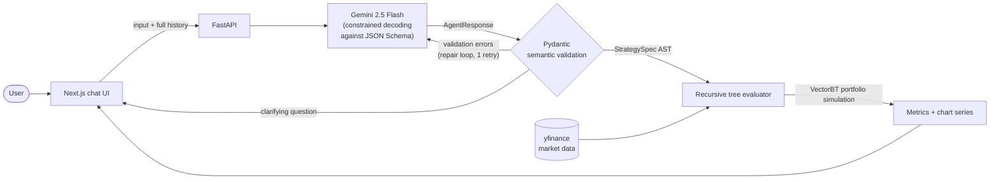

# BacktestGPT

**Describe a trading strategy in plain English → get a full backtest with performance metrics and charts.**


> *"Buy Nvidia whenever it falls 2% in a day, take profit at 5%"* — that sentence is the entire input. BacktestGPT compiles it into a typed, validated strategy AST and executes it against real market data with VectorBT.

<!-- Screenshots: drop images in docs/screenshots/ and they'll render here -->


## The Interesting Part: Natural Language → Typed Strategy AST

Most LLM-powered tools either parse free-text model output with regexes (fragile) or let the model write executable code (needs sandboxing). BacktestGPT takes a third path: **schema-constrained decoding into a domain-specific AST**.



**One structured LLM call per turn.** The model sees the whole conversation and a JSON Schema generated from Pydantic models. Gemini's constrained decoding eliminates schema-invalid tokens *while the response is generated* — "the model returned prose instead of JSON" is structurally impossible. The model either asks one clarifying question or emits a complete strategy.

**A recursive expression language, not a rigid template.** Conditions are trees: comparison leaves (`cross_above`, `lte`, ...) composed by `and`/`or`/`not` at any depth. Operands are themselves recursive — indicator outputs, price columns, constants, transforms (`pct_change`, `rolling_max`, `shift`, ...), and arithmetic over other operands. That's how *"price at least 10% below its 52-week high on double average volume"* stays expressible without a single line of generated code.

The dip-buying example above compiles to:

```json
{
  "ticker": "NVDA",
  "take_profit": 0.05,
  "indicators": [],
  "entry": {
    "op": "lte",
    "left": {
      "kind": "transform", "transform": "pct_change", "periods": 1,
      "operand": { "kind": "price", "column": "Close" }
    },
    "right": { "kind": "constant", "value": -0.02 }
  },
  "exit": null
}
```

**Semantic validation the schema can't express, with a repair loop.** Pydantic validators check that every indicator reference points to a declared indicator with a valid output, operator arity is correct, and ids are unique. On failure, the exact errors go back to the model for one corrected attempt — mirroring benchmark findings that error feedback lifts LLM structured-generation success rates from ~75% to ~95%+.

**Deterministic, sandbox-free execution.** The engine walks the validated tree into boolean signal series and hands them to VectorBT. No LLM output is ever interpreted as code, so there is nothing to sandbox and results are exactly reproducible from the spec JSON.

**Stateless server.** Conversation state lives entirely in the chat history the client sends — no sessions to collide, expire, or lose on redeploy.

### Engineering Decisions

| Decision | Alternative considered | Why this way |
|---|---|---|
| Constrained decoding into an AST | LLM writes Python, run in a sandbox | Benchmarks show ~70–76% single-shot correctness for generated backtest code; an AST is verifiable *before* execution and needs no sandbox |
| Recursive expression schema | Flat `{op, args}` rule format | Flat formats can't express compound logic; recursion via JSON Schema `$ref` costs nothing extra |
| Repair loop (1 retry with errors) | Fail on first invalid output | Error feedback is the cheapest reliability multiplier in structured generation |
| Refuse inexpressible requests | Approximate with nearest supported strategy | Silently backtesting a *different* strategy than asked is the worst failure mode a finance tool can have |
| Stateless API | Server-side conversation store | Free-tier dynos restart constantly; client-held history makes cold starts invisible |

## Failure Handling

Every layer degrades conversationally — the user never sees a stack trace:

- **Ambiguous prompt** → the model returns no strategy and asks one targeted question, building on established context.
- **Inexpressible request** (news sentiment, earnings dates, fundamentals) → the model says so explicitly and names the closest supported alternative; it is instructed never to substitute silently.
- **Schema-invalid output** → repair loop with validation errors; after two failures, a friendly rephrase suggestion with a worked example.
- **Unknown ticker** → validated against yfinance (cached) before any backtest runs.
- **Empty data range / API overload** → clean conversational error with a suggested fix; transient 503/429s retry with backoff.

## Strategy Vocabulary

**Indicators** — SMA, EMA, RSI, Bollinger Bands, MACD (all parameterizable: windows, std-devs, fast/slow/signal periods)

**Comparisons** — `cross_above`, `cross_below`, `gt`, `lt`, `gte`, `lte`
**Combinators** — `and`, `or`, `not` (arbitrarily nested)
**Transforms** — `pct_change`, `shift`, `rolling_max`, `rolling_min`, `rolling_mean`, `rolling_std`, `abs`
**Arithmetic** — `add`, `sub`, `mul`, `div` between any expressions
**Risk controls** — fractional `stop_loss` / `take_profit` applied by the portfolio simulator
**Parameters** — date range, starting cash, fees — all settable from natural language

**Metrics reported** — total return, CAGR, Sharpe, Sortino, max drawdown, win rate, profit factor, avg win/loss, trade count — plus equity-curve, drawdown, indicator, and signal series for charting.

## API

| Endpoint | Purpose |
|---|---|
| `POST /natural_backtest` | Conversational NL backtesting (`{input, conversation_history}`) |
| `POST /backtest_spec` | Run a strategy AST directly — no LLM involved |
| `POST /backtest` | Preset strategies (SMA crossover, RSI) with simple params |
| `GET /health` | Health check |

Interactive OpenAPI docs at `/docs` when running.

## Quickstart

```bash
# Backend (Python 3.11)
pip install -r backend/requirements.txt
cp .env.example .env          # add your Gemini API key (aistudio.google.com/apikey)
uvicorn backend.main:app --reload          # http://localhost:8000

# Frontend
cd app && npm install && npm run dev       # http://localhost:3000
```

### Tests

```bash
pip install -r backend/requirements-dev.txt
pytest tests/
```

34 tests cover schema semantics (reference resolution, operator arity, nested-expression validation), engine evaluation on synthetic price data (crossovers, compound conditions, transforms, full spec runs), and agent behavior against a mocked Gemini client (clarification turns, the repair loop, graceful give-up). No network or API key required.

## Project Structure

```
├── backend/
│   ├── schema.py          # Typed strategy AST (Pydantic) — single source of truth
│   ├── llm_decode.py      # NL agent: constrained decoding + repair loop
│   ├── backtest_loop.py   # Engine: recursive AST evaluation with VectorBT
│   └── main.py            # FastAPI routes
├── app/                   # Next.js 15 / React 19 / TypeScript chat UI with Chart.js
├── tests/                 # Pytest: schema, engine, agent, API
└── render.yaml            # Backend deploy config (frontend deploys on Vercel)
```

## Deployment

Frontend: import in [Vercel](https://vercel.com) with root directory `app`, set `NEXT_PUBLIC_API_URL` to the backend URL.
Backend: deploy the `render.yaml` blueprint on [Render](https://render.com), set `GEMINI_API_KEY` in the dashboard. Keys are environment-only — `.env` is git-ignored and all LLM calls happen server-side.

## Roadmap

- **Translation eval harness** — golden dataset of prompt→AST pairs scored in CI, so prompt changes are measured, not vibes
- **Provider-agnostic LLM layer** — Gemini / Groq / local models behind one strict-schema interface
- **Overfitting guards** — train/test date splits and walk-forward validation surfaced in results
- **Parameter sweeps** — vectorized grid search over indicator windows with heatmap visualization
- **Agentic code-gen mode** — sandboxed generated-code path for strategies beyond the AST vocabulary

## Disclaimer

For educational and research purposes only. Past performance does not guarantee future results.

## License

MIT
